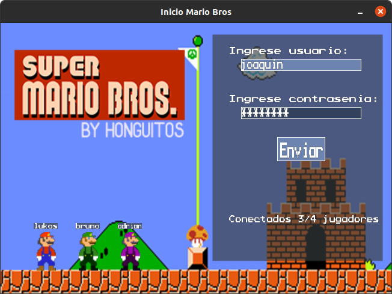
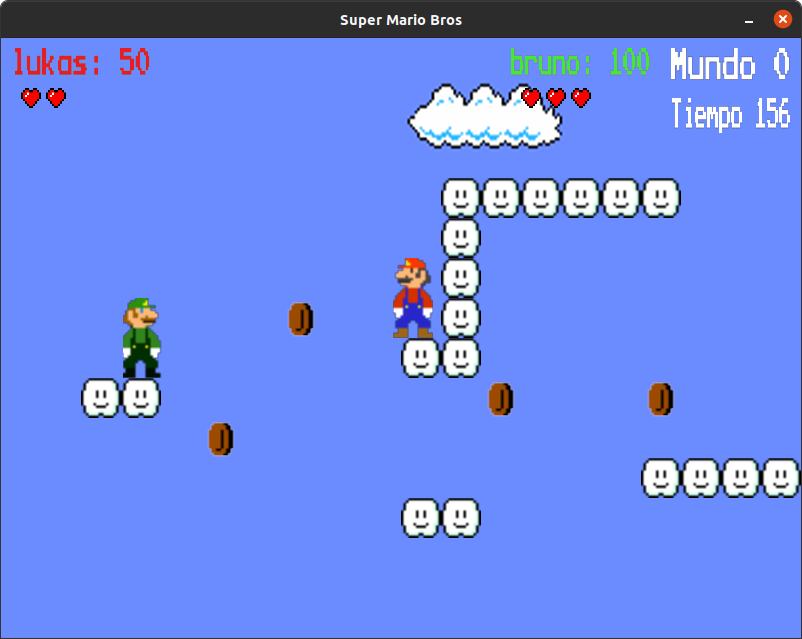
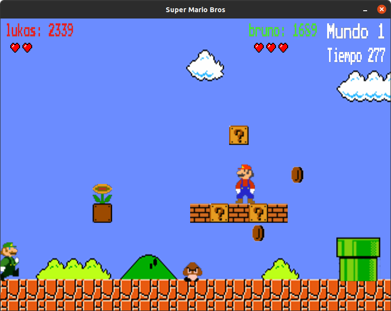
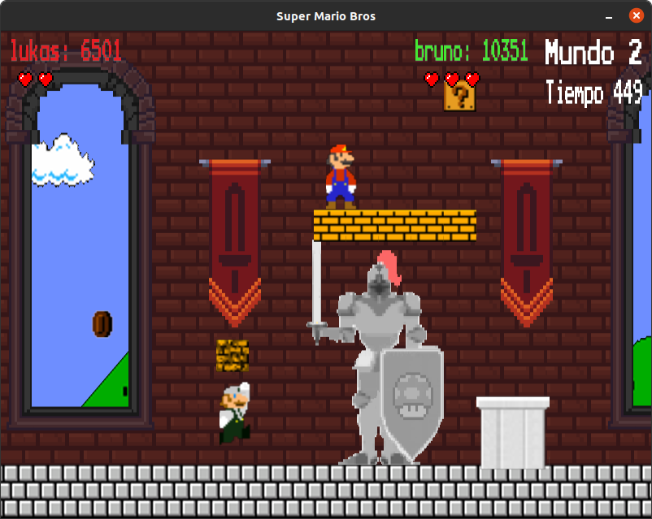
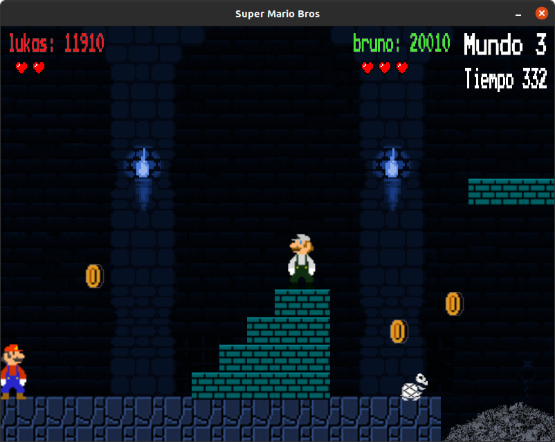
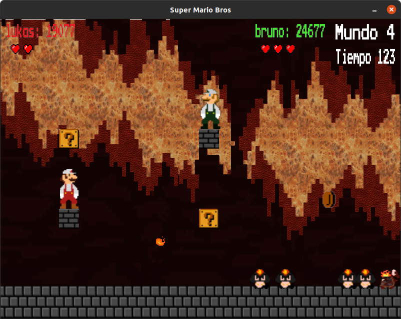

# TP de Taller de programación 1 - Azcurra

[](https://travis-ci.com/brunograssano/SuperMarioBros-Honguitos)

## Índice
- [Descripción](#descripción)
- [Miembros del grupo](#grupo-honguitos)
- [Pre-requisitos](#pre-requisitos)
- [Instalación](#instalación)
- [Ejecución](#ejecutando-la-aplicación)
- [Controles del juego](#como-jugar)
- [Ejecutando las pruebas](#ejecutando-las-pruebas)
- [Videos](#videos)
- [Imágenes](#imágenes-de-la-aplicación)
- [Licencia](#licencia)

## Descripción

Trabajo practico de la materia Taller de programación 1.

El presente trabajo consistió en el armado de un juego de plataformas, tomando como referencia el Super Mario Bros.
El mismo se hizo de forma tal de que se pueda jugar a través de diferentes niveles de forma online, permitiendo desde 1 a 4 jugadores.

El juego actualmente dispone de 5 niveles distintos para la configuración inicial, y otros 3 para la default. 
En caso de querer crear nuevos niveles se puede realizar armando el correspondiente archivo XML con la configuración deseada.


    
## Grupo Honguitos
* De Angelis Riva, Lukas
* Gomez, Joaquín
* Grassano, Bruno
* Romero, Adrián

## Manejo de recursos aparte

Tablero de [Trello](https://trello.com/b/sdukQHiL/tp-taller)

## Pre-requisitos

Listado de software/herramientas necesarias para el proyecto

* C++
* SDL2 / SDL2_image / SDL2_ttf / SDL2_mixer
* CMake
* Sistema operativo basado en Linux

En cuanto a requerimientos de hardware, se necesitan:

* Para ejecutar el cliente: ~55MB de RAM
* Para ejecutar el servidor: ~2MB de RAM
* ~25MB de espacio en disco
* En cuanto a CPU, la aplicación esta bastante optimizada.

## Instalación

Para la instalación del trabajo practico se puede utilizar el instalador provisto, o realizarlo a mano.

* Mediante el instalador
    1. Ejecutar el instalador desde la terminal parado en la carpeta del juego con ```bash Instalador.sh```
    2. Si no tiene alguna de las dependencias para que el juego funcione correctamente, las puede instalar escribiendo ```a```, si no es necesario puede usar ```i``` directamente.
    3. Salir con ```q```.

* Para realizarla a mano, ejecutar la siguiente lista de comandos desde la carpeta del juego.
    ```
    mkdir build
    cd build
    cmake ..
    sudo make
    cp -r "../resources" "resources"
    ```

## Ejecutando la aplicación

Para ejecutar la aplicación debe hacerlo desde línea de comando. 
```
./Mario [opciones]
```
**[opciones]**

Se detallan a continuación las opciones.
```
-s,--server            Iniciara la aplicacion en modo servidor
-i,--ip                Requiere a continuacion de la ip (para conectarse o iniciar un servidor)
-p,--puerto            Requiere a continuacion del puerto (para conectarse o iniciar un servidor)
-l,--log               Permite cambiar el nivel del log entre error, info, o debug. (Cada uno se puede escribir en los formatos error,Error,ERROR)
-c,--config            Solo disponible en modo servidor, requiere de una direccion a un archivo XML a continuacion suyo
-t,--test              Correra los tests realizados
-h,--help              Muestra esta informacion
```

Ejemplos

```
./Mario -s --config direccionConfiguracion -p puerto -i IP 
./Mario -s -c resources/ArchivosXML/configuracionInicial.xml -p 5005 -i 127.0.0.1

./Mario -l nivelLog --puerto puerto -i IP
./Mario -l INFO -p 5005 -i 127.0.0.1
```
El primer ejemplo iniciara un servidor con las configuraciones indicadas. En el segundo caso se inicia un cliente que se conectara al servidor. (En el ejemplo se prueba con localhost, pero funciona sin problemas en una red local)

## Como jugar

El juego tiene los siguientes controles:
* A,W,S,D o las correspondientes flechas para el movimiento.
* Espacio para disparar bolas de fuego.
* T para entrar en modo TEST (Los enemigos no te hacen daño y no se pierden vidas)
* M para apagar la música.
* N para apagar los sonidos del juego.
* Z activa un easter egg.

## Ejecutando las pruebas

A lo largo del desarrollo del trabajo se han hecho algunas
pruebas para poder evaluar el correcto funcionamiento del modelo.
 Estas se pueden ejecutar de las siguientes maneras.
```
./Mario -t
./Mario --test

* Siendo Mario el nombre del ejecutable que se tenga
```

## Videos

### Fase 1

* [Pruebas Generales](https://youtu.be/2WTP9P2Rlxk)

* [Pruebas](https://youtu.be/LNObWOaGVbM)

### Fase 2

* [Pruebas Generales](https://youtu.be/xjKjGTvPpN8)

* [Pruebas](https://youtu.be/ek3vNrkeR5E)

### Fase 3

* [Pruebas Generales](https://youtu.be/2_D5a1RFYDs)

* [Pruebas](https://youtu.be/lr8mGXFn7Go)

## Imágenes de la aplicación

### Ventana de inicio


### Niveles
#### Mundo 0 "Parkour"


#### Mundo 1 "Outside"


#### Mundo 2 "Castle"


#### Mundo 3 "Dungeon"


#### Mundo 4 "Inferno"


## Licencia
Este repositorio esta bajo licencia MIT
