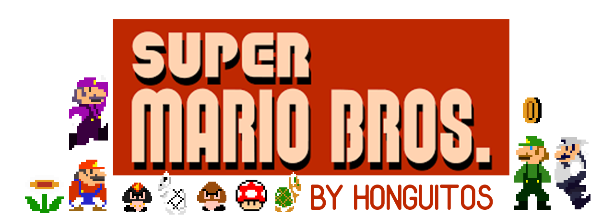

# TP de Taller de programación 1 - Azcurra

[](https://travis-ci.com/brunograssano/TP-taller-de-programacion-fiuba)

Trabajo practico de la materia Taller de programación 1.
  
## Grupo Honguitos
* De Angelis Riva, Lukas
* Gomez, Joaquín
* Grassano, Bruno
* Romero, Adrián

## Manejo de recursos aparte

Tablero de Trello - [link](https://trello.com/b/sdukQHiL/tp-taller)

## Pre-requisitos
Listado de software/herramientas necesarias para el proyecto

* C++
* SDL2 / SDL2_image / SDL2_ttf / SDL2_mixer
* CMake
* Sistema operativo basado en Linux

## Ejecutando las pruebas
A lo largo del desarrollo del trabajo se han hecho algunas
pruebas para poder evaluar el correcto funcionamiento del modelo.
 Estas se pueden ejecutar de las siguientes maneras.
```
./Mario -t
./Mario --test

* Siendo Mario el nombre del ejecutable que se tenga
```

## Ejecutando la aplicación
Para ejecutar la aplicación...

### Como jugar
...

## Detalles de implementación
...

## Licencia
Este repositorio esta bajo licencia MIT

## Imágenes de la aplicación
